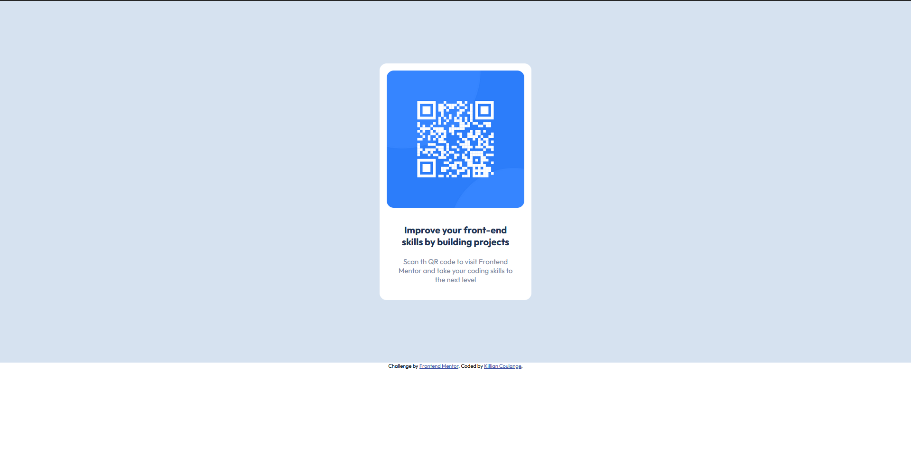
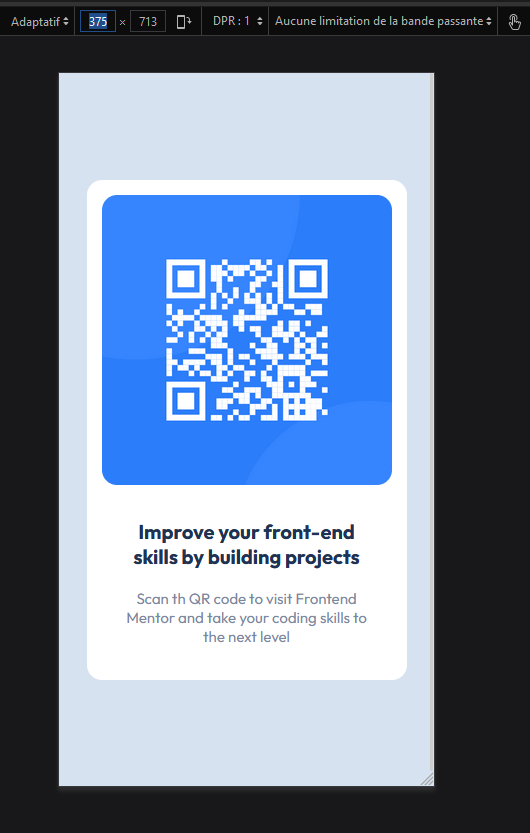

# Frontend Mentor - QR code component solution

This is a solution to the [QR code component challenge on Frontend Mentor](https://www.frontendmentor.io/challenges/qr-code-component-iux_sIO_H). Frontend Mentor challenges help you improve your coding skills by building realistic projects.

## Table of contents

- [Overview](#overview)
  - [Screenshot](#screenshot)
- [My process](#my-process)
  - [Built with](#built-with)
  - [How I build](#how-i-build)
  - [What I learned](#what-i-learned)
  - [Useful resources](#useful-resources)
- [Author](#author)

## Overview

### Screenshot




## My process

### Built with

- Semantic HTML5 markup
- CSS custom properties
- Flexbox
- Mobile-first workflow

### How I build

I create my repo on git hub. Then I copy the project from [Frontend Mentor](https://www.frontendmentor.io/challenges/qr-code-component-iux_sIO_H/hub/qr-code-component-6t4kFprhG).
After reading the [README](./vendor/README.md), I open the JPG images of design on krita to calculate the different spacing design.
Then I build my html structure, and finally I write my css.

### What I learned

I learn how write a README file.
I've been some problem with collapsing margins, that was my first time and I saw that I can resolve the problem with something like that :

```css
#card {
  overflow: hidden;
}
```

### Useful resources

- [Collapse margin](https://www.alsacreations.com/article/lire/629-fusion-des-marges.html) - This helped me for resolve a proble of margin on my div.

## Author

- Website - [Killian Coulange](https://github.com/Genshie)
- Frontend Mentor - [@Genshie](https://www.frontendmentor.io/profile/Genshie)
